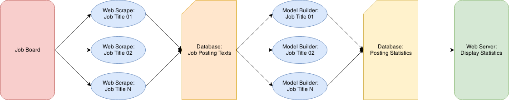

# README

Scriter is a web application that scrapes job posting data from various
websites and visualizes the outputs on a server.

### Architecture

For prototyping purposes, the following three components run on the
same server.

* Weekly Web Scraper Job to Gather Data (Python + cron)

* DB to Store Data (Postgres)

* Web Server to Display Data (Apache)

### Development Status

**Data Load**

| Status  | Task |
|---|---|
| Done | Basic Web Scraper |
| Done | Data Cleaning Process |
| Done | Temporary Database Setup |
| Done | Database Load Process |
| Done | Parametrize Web Scrape (Job Title) |
| TBD | Switch from SQLite to Postgresql |
| TBD | Cron Web Scrape |
| TBD | Parameterize for Multiple Sources |

**Data Access**

| Status  | Task |
|---|---|
| Done | Query database |
| Done | Create a TF-IDF model |
| TBD | Store the TF-IDF model |
| Done | Refine the TF-IDF model |

**Web Stack**

| Status  | Task |
|---|---|
| TBD | Create locally hosted site |
| TBD | Visualize TF-IDF models |
| TBD | Deploy site to scriter.net domain |
