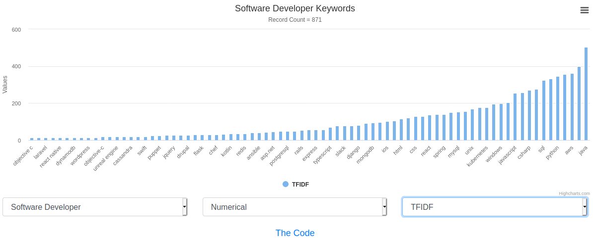
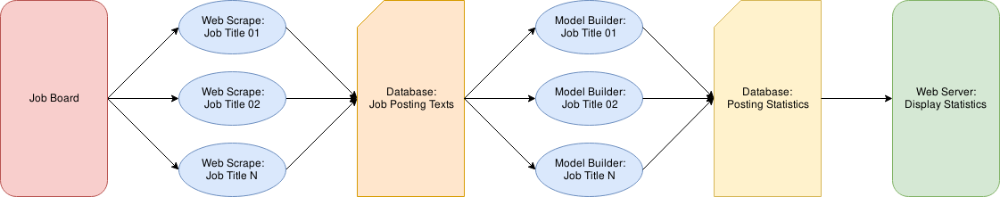

# README

Scriter is a web application that scrapes job posting data and visualizes the outputs.



### Setup and Usage

An installer has been provided to simplify initial setup. Ensure that **Ansible** is installed on an Ubuntu 20.04 server, then use the following steps:

```
[user]$ sudo su
[root]# ansible-playbook setup/install.yml
[root]# sudo su scriter
[scriter]$ python setup/first_run.py
```

***Test Local Deployment***

```
[scriter]$ python web_server/scriter/manage.py runserver
< CTRL-C to Kill>
```

***Production Deployment***

```
[scriter]$ ansible setup/deploy.yml
```

### Subsystem Usage

***Web Scrape***

```
[scriter]$ cd web_scraper/
[scriter]$ scrapy runspider web_scrape.py -o software_engineer.csv -s CLOSESPIDER_PAGECOUNT=1000 -a job_title='software+engineer'
```

***Load Data into PostgreSQL***

```
[scriter]$ cd web_scraper/
[scriter]$ python data_load.py software_engineer.csv software_engineer
```

***Generate Metrics from Data***

```
[scriter]$ cd data_modeler/
[scriter]$ python model_build.py software_engineer
```

***Set Keywords***

```
[scriter]$ vim data_modeler/tech.json
```

### Architecture

The application is written in Python and consists of four separate components, loosely coupled.

* Web Scraper Job to Gather Data (Scrapy)

* DB to Store Data (sqlalchemy + Postgres)

* Model Builder to convert raw job posting text into TFIDF metrics (sklearn + NLTK)

* Web Server to Display Data (Django + Highcharts)



